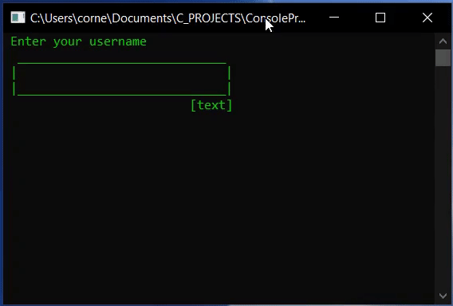
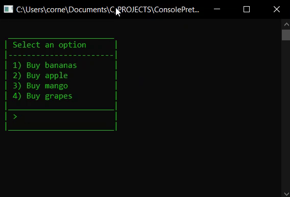

# Console Prettify🎨 (alpha)
A simple tool for making good UI in C/C++ console applications on Windows with little effort.

---

## How to Use 🖥️
Download or clone this repository. Copy `prettify_functions.c` and `ConsolePrettify.h` into your project folder and add `#include "ConsolePrettify.h"` in your C/C++ files.

Make sure the new files are correctly linked in your IDE/compiler.

## Available Functions

Function | Description
--- | --- 
_text_
`cp_textcolor(color)` | Changes the text color
`cp_print(format, args)` | Exactly like printf, but text is centered
_input_
`cp_textbox(specifier, variable)` | Like scanf with a input box
`cp_password(variable)` | string input box with masking eg. *****
_selection_
`cp_menu(title, numOptions, ...)` | Displays a menu and returns the number of the selected option
_lists_
`cp_ilist(title, items, numItems)` | Displays an ordered list of integers
`cp_flist(title, items, numItems)` | Displays an ordered list of floats
`cp_clist(title, items, numItems)` | Displays an ordered list of characters
`cp_slist(title, items, numItems)` | Displays an ordered list of strings

---
> _**NOTE**: Please use `cp_textcolor()` instaed of system("color xx")._ 

> _**NOTE**: `cp_textbox()` accepts ONE variable. Do not use multiple specifiers_

<br>

## Available Colors 🌈
use any of these constants as the color arguments of prettify functions
Constant Name | Value
--- | --- 
RED | 12
GREEN |  10
LIGHT_BLUE | 11
YELLOW | 6
LIGHT_YELLOW | 14
BLUE | 9
PURPLE | 5
WHITE | 15
CYAN | 3
GRAY | 7
DARK_GRAY | 8

<br>

# Examples
### Text & input:

```c
char testString[25];
cp_textcolor (GREEN); //change color

printf (" Enter your username");
cp_textbox ("%s", testString);

printf ("\n Enter your password:");
cp_password (testString);
```



## Menus
```c
int choice = cp_menu("Select an option", 4,
                  "Buy bananas",
                  "Buy apple",
                  "Buy mango",
                  "Buy grapes");
```



### Lists
```c
float items[20] = {200, 10, 80, 900, 20, 10, 80, 900, 209, 50};
cp_flist ("List of numbers", items, 10);
```
>

## TODO
- Add automatic Table printing

## License
---
ConsolePrettify is MIT licensed.